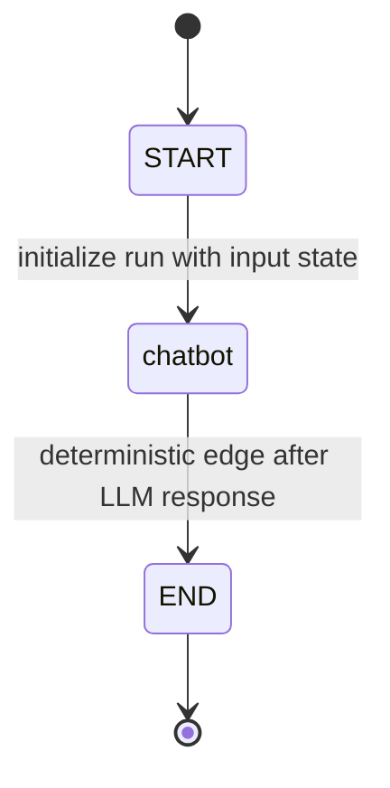
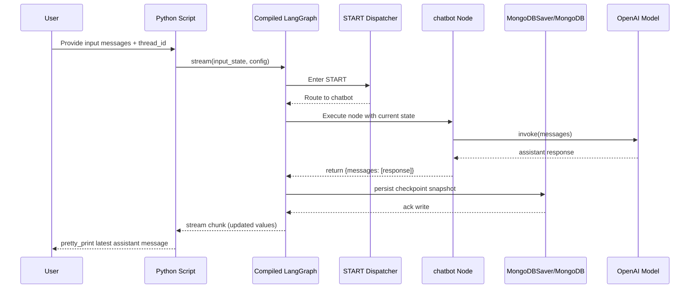
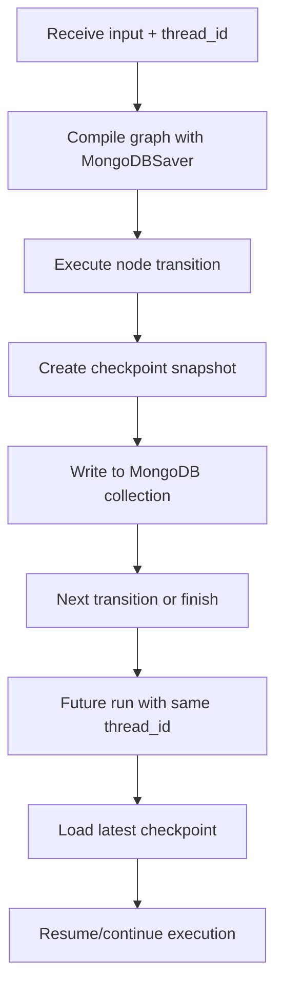
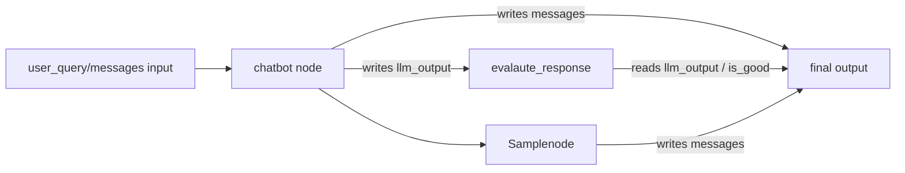

# LANGGRAPH_NOTES

## 1) Project Architecture Overview

This project demonstrates three progressively richer LangGraph patterns: a linear message graph ([chat.py](chat.py)), an experimental branching scaffold ([chat2.py](chat2.py)), and a working MongoDB-checkpointed conversational graph ([chat_checkpoint.py](chat_checkpoint.py)). The core idea is to model LLM workflow as explicit graph transitions over typed state, then optionally persist state transitions by `thread_id` so a conversation can be resumed and inspected across runs.

### High-level system architecture

<!-- Diagram: Top-bottom architecture showing user input, LangGraph runtime, LLM provider, and MongoDB checkpoint storage. -->
```mermaid
graph TB
    User[User / Client Input]
    App[Python Entrypoint Script]
    StateSchema[Typed State Schema]
    GraphBuilder[LangGraph StateGraph Builder]
    CompiledGraph[Compiled Graph Runtime]
    ChatbotNode[Node: chatbot]
    SampleNode[Node: Samplenode\n(linear demo only)]
    LLM[OpenAI gpt-4.1-mini]
    Checkpointer[MongoDBSaver]
    Mongo[(MongoDB)]
    Output[Final / Streamed Response]

    User --> App
    App --> StateSchema
    App --> GraphBuilder
    GraphBuilder --> CompiledGraph
    CompiledGraph --> ChatbotNode
    ChatbotNode --> LLM
    LLM --> ChatbotNode
    ChatbotNode --> SampleNode
    SampleNode --> Output

    CompiledGraph --> Checkpointer
    Checkpointer --> Mongo
    Mongo --> Checkpointer
    CompiledGraph --> Output
```

### File inventory (project root: `langraph_learning`)

- `.env` — local environment variables for API keys/connection settings.
- `chat.py` — complete linear LangGraph demo with `messages` reducer.
- `chat2.py` — incomplete branching prototype with intended conditional routing.
- `chat_checkpoint.py` — working LangGraph + MongoDB checkpoint streaming demo.
- `docker-compose.yml` — local container orchestration (likely Mongo and supporting services).
- `req` — duplicate requirements-style dependency list.
- `requirements.txt` — pinned Python dependencies.

### Tech stack (from code + requirements)

- **LangGraph**: `langgraph==0.6.10`
- **Checkpoint core**: `langgraph-checkpoint==2.1.2`
- **Mongo checkpointer**: `langgraph-checkpoint-mongodb==0.2.1`
- **Mongo driver**: `pymongo==4.15.3`
- **LLM orchestration wrapper**: `langchain==0.3.27`, `langchain-core==0.3.79`
- **OpenAI integrations**:
  - SDK: `openai==2.2.0`
  - LangChain adapter: `langchain-openai==0.3.35`
- **Config management**: `python-dotenv==1.1.1`

---

## 2) LangGraph Core Concepts (as used in this project)

## 2.1 StateGraph and state schema definition

**What it is**

`StateGraph` is a directed workflow where each node reads/writes a shared typed state object. The schema acts as the contract for allowed keys and merge behavior.

**How it works internally**

LangGraph tracks state channels and reducer behavior per field. On each node return, it merges updates into current state, then resolves next edge(s) until `END`.

**Where used**

- [chat.py](chat.py): `class State`, `graph_builder = StateGraph(State)`
- [chat_checkpoint.py](chat_checkpoint.py): `class State`, `graph_builder = StateGraph(State)`
- [chat2.py](chat2.py): `class State`, `graph_builder = StateGraph(State)`

**Code snippet**

```python
class State(TypedDict):
    messages: Annotated[list, add_messages]

graph_builder = StateGraph(State)
```

**Flow diagram**

<!-- Diagram: Left-right state-channel evolution for the canonical checkpointed graph. -->
```mermaid
graph LR
    S0[Input State\nmessages=[user]] --> S1[chatbot node\nadds assistant message]
    S1 --> S2[Reducer merge\nadd_messages]
    S2 --> S3[Final State\nmessages=[user, assistant]]
```

## 2.2 Nodes

**What it is**

A node is a callable unit of work that receives current state and returns either a partial update or the updated state object.

**How it works internally**

Runtime executes node function, captures returned value, validates/merges it, and schedules next transition based on graph edges.

**Where used**

- [chat.py](chat.py): `chatbot(state)`, `Samplenode(state)`
- [chat_checkpoint.py](chat_checkpoint.py): `chatbot(state)`
- [chat2.py](chat2.py): `chatbot(state)` (duplicate definition; second overrides first)

**Code snippet**

```python
def chatbot(state: State):
    response = llm.invoke(state.get("messages"))
    return {"messages": [response]}
```

## 2.3 Edges (normal vs conditional)

**What it is**

Edges define routing between nodes. Normal edges are deterministic; conditional edges route based on a function result.

**How it works internally**

For deterministic edges, runtime always transitions to configured target. For conditional edges, runtime calls router function and maps returned label to next node.

**Where used**

- Deterministic edges:
  - [chat.py](chat.py): `START -> chatbot -> Samplenode -> END`
  - [chat_checkpoint.py](chat_checkpoint.py): `START -> chatbot -> END`
- Conditional routing intent (prototype):
  - [chat2.py](chat2.py): `evalaute_response(state) -> Literal[...]`

**Code snippet**

```python
graph_builder.add_edge(START, "chatbot")
graph_builder.add_edge("chatbot", END)
```

## 2.4 State management and reducers

**What it is**

State management is how node outputs are combined into one evolving state object across transitions.

**How it works internally**

Each state key can have merge semantics. With `Annotated[..., add_messages]`, LangGraph appends/merges message updates instead of replacing entire history.

**Where used**

- [chat.py](chat.py): `messages: Annotated[list, add_messages]`
- [chat_checkpoint.py](chat_checkpoint.py): same reducer pattern
- [chat2.py](chat2.py): direct in-place state mutation pattern (no reducer on fields)

**Code snippet**

```python
class State(TypedDict):
    messages: Annotated[list, add_messages]
```

## 2.5 Graph compilation (`.compile()`)

**What it is**

Compilation transforms the graph builder declaration into an executable runtime object.

**How it works internally**

LangGraph validates node/edge topology, binds reducers/checkpointers, and creates execution plan/state handling machinery.

**Where used**

- [chat.py](chat.py): `graph = graph_builder.compile()`
- [chat_checkpoint.py](chat_checkpoint.py):
  - `graph = graph_builder.compile()`
  - `graph_builder.compile(checkpointer=checkpointer)`

**Code snippet**

```python
graph = graph_builder.compile()
# with persistence
compiled = graph_builder.compile(checkpointer=checkpointer)
```

## 2.6 MongoDB checkpointing

**What it is**

Checkpointing persists graph execution state so runs can be resumed/retrieved by thread/session identity.

**How it works internally**

When compiled with `MongoDBSaver`, LangGraph writes checkpoint snapshots and metadata keyed by `thread_id` (and internal checkpoint IDs) at execution boundaries.

**Where used**

- [chat_checkpoint.py](chat_checkpoint.py):
  - `MongoDBSaver.from_conn_string(...)`
  - `compile_graph_with_checkpointer(checkpointer)`
  - `config = {"configurable": {"thread_id": "Akash"}}`
  - `graph_with_checkpoint.stream(..., config, stream_mode="values")`

**Code snippet**

```python
with MongoDBSaver.from_conn_string(DB_URI) as checkpointer:
    graph_with_checkpoint = graph_builder.compile(checkpointer=checkpointer)
    config = {"configurable": {"thread_id": "Akash"}}
```

## 2.7 Human-in-the-loop / interrupts

**Status in this project**

Not implemented in current files. No `interrupt()` usage or pause/resume prompts were found.

## 2.8 Tool/function-calling integration

**Status in this project**

Not implemented in current files. No `ToolNode`, tool schemas, or function-calling routers were found.

## 2.9 Subgraphs

**Status in this project**

Not implemented in current files. No nested/embedded graph composition found.

---

## 3) Graph Flow Walkthrough

### Complete execution flow (checkpointed graph)

<!-- Diagram: State-machine view of the working MongoDB-checkpointed graph execution path. -->


### Node-by-node walkthrough (working graph in `chat_checkpoint.py`)

1. **Node: `chatbot`**
   - **Input state shape**: `{ "messages": [<user/system/ai messages>] }`
   - **Processing**:
     - Calls `llm.invoke(state.get("messages"))`
     - Gets assistant response object
   - **Output state shape**: `{ "messages": [<assistant response>] }` as a partial update
   - **Outgoing edges**: always to `END`

### Sequence lifecycle with checkpoint saves

<!-- Diagram: End-to-end request sequence including LangGraph runtime, LLM call, and MongoDB checkpoint persistence. -->


---

## 4) MongoDB Checkpointing Deep Dive

### Why checkpointing is needed

Checkpointing provides resilience and continuity:
- recoverable execution state per conversation/thread,
- replayability/debuggability of graph transitions,
- multi-turn continuity without manually storing full state externally.

### Stored data shape (representative)

The exact document layout can vary by version, but a typical LangGraph Mongo checkpoint record is conceptually:

```json
{
  "thread_id": "Akash",
  "checkpoint_ns": "",
  "checkpoint_id": "uuid-or-monotonic-id",
  "parent_checkpoint_id": "previous-checkpoint-id",
  "checkpoint": {
    "v": 1,
    "ts": "2026-03-16T...Z",
    "channel_values": {
      "messages": ["..."]
    },
    "channel_versions": {
      "messages": 3
    },
    "versions_seen": {}
  },
  "metadata": {
    "source": "graph_runtime"
  }
}
```

### When checkpoints are created

In this project’s working flow ([chat_checkpoint.py](chat_checkpoint.py)), checkpoints are written during graph execution while streaming values (`stream_mode="values"`), keyed by the configured `thread_id`.

### How resume works

On a subsequent call with the same `thread_id` in `config["configurable"]`, the checkpointer can retrieve latest checkpoint lineage and continue with persisted state context according to LangGraph runtime semantics.

### `thread_id` / session management

- `thread_id` is the logical conversation/session key.
- All checkpoint reads/writes are scoped to that key.
- Changing `thread_id` starts an isolated execution history.

### Checkpoint lifecycle

<!-- Diagram: Lifecycle of checkpoint creation, storage, and retrieval for a single thread_id. -->


### Collection structure and indexes (recommended)

Typical useful indexes:
- `{ thread_id: 1, checkpoint_ns: 1, checkpoint_id: -1 }` for latest checkpoint lookup.
- Optional TTL/indexing strategy depending on retention policy.

---

## 5) State Schema Reference

### Canonical conversation schema (`chat.py`, `chat_checkpoint.py`)

```python
class State(TypedDict):
    messages: Annotated[list, add_messages]
```

| Field | Purpose | Writers | Readers |
|---|---|---|---|
| `messages` | Conversation history channel | `chatbot()`, `Samplenode()` | `chatbot()` and runtime stream/output handlers |

### Experimental branching schema (`chat2.py`)

```python
class State(TypedDict):
    user_query: str
    llm_output: Optional[str]
    is_good: Optional[bool]
```

| Field | Purpose | Writers | Readers |
|---|---|---|---|
| `user_query` | Raw user prompt | external caller | `chatbot()` |
| `llm_output` | Generated answer for further routing | `chatbot()` | `evalaute_response()` (intended) |
| `is_good` | Quality decision flag | evaluator node (intended) | conditional router (intended) |

### State dependency flow

<!-- Diagram: Left-right dependency map of state fields and which nodes read/write them. -->


---

## 6) Key Patterns and Trade-offs

### Architectural decisions and why

1. **TypedDict state contracts**
   - Keeps node interfaces explicit and easier to reason about.
2. **Reducer-based `messages` state**
   - Avoids manual list merge logic and makes append semantics explicit.
3. **Separate compile path with checkpointer**
   - Lets same graph topology run with or without persistence backend.

### What could break at scale

- Single `thread_id` collisions if caller does not generate unique session IDs.
- MongoDB growth without retention/index strategy.
- LLM latency bottlenecks under high parallel load.
- Incomplete branching code in [chat2.py](chat2.py) if promoted without hardening.

### If production with 1000 concurrent users

- Generate stable unique `thread_id` per user/session.
- Add connection pooling and robust Mongo indexes.
- Add retries/timeouts/circuit breakers around LLM calls.
- Add observability (traces, structured logs, LangSmith).
- Refactor node code to pure delta returns for consistency.

### Alternatives worth considering

- Redis/Postgres checkpointer backends for different durability/latency trade-offs.
- Tool-enabled graphs (`ToolNode`) for external function orchestration.
- Subgraphs for reusable multi-step workflows.

---

## 7) Quick Reference Cheatsheet

### LangGraph APIs used here

- `StateGraph(State)` — create a graph builder with typed state schema.
- `add_node(name, fn)` — register a callable node.
- `add_edge(from, to)` — deterministic transition.
- `compile()` — build executable graph runtime.
- `compile(checkpointer=...)` — build runtime with persistence integration.
- `invoke(input_state)` — run to completion and return final state.
- `stream(input_state, config, stream_mode="values")` — stream intermediate state snapshots.

### Common debugging patterns

- Print node input/output state deltas per node transition.
- Run one fixed `thread_id` repeatedly to inspect checkpoint continuity.
- Temporarily enable small deterministic prompts to reduce LLM variance.

### Add a new node (step-by-step)

1. Define node function with state input and delta/state output.
2. Register it with `graph_builder.add_node("new_node", new_node)`.
3. Add inbound/outbound edges (`add_edge` or conditional routing).
4. Recompile graph.
5. Validate with `invoke()` and/or `stream()`.

### Add a new conditional edge (step-by-step)

1. Implement router function returning symbolic route labels.
2. Ensure target nodes are registered.
3. Attach conditional routing with LangGraph conditional-edge API.
4. Recompile and test each branch with controlled inputs.
5. Verify persisted checkpoints per branch when using MongoDB saver.
